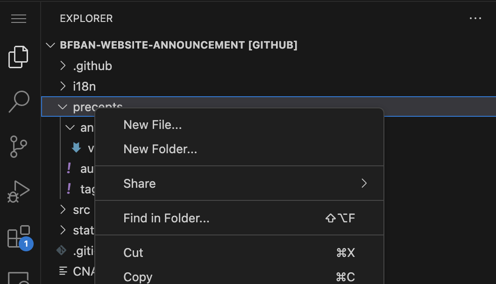
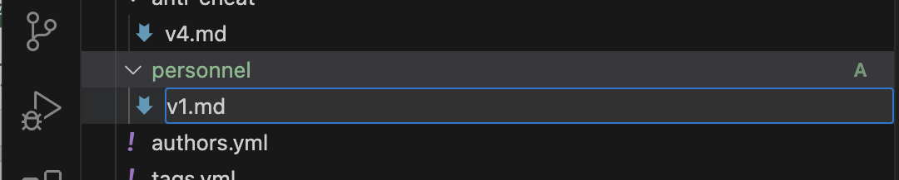
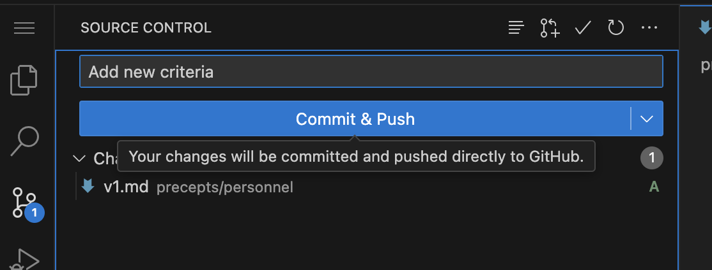

## 调试以及本地部署

实时预览,在目录下执行

```shell
npm run start
```

调试模式通常无法预览其他语言效果，你应当使用下方命令来运行一个本地服务器来查看最终效果

```shell
npm run build
npm run serve
```

## 创建准则或公告(面向非开发者)

通常可以通过常规ide拉取本地创建文件在推送方式，考虑到无ide情况，可以利用github+vscode.dev方式快速创建或修改。

### github+vscode.dev

在本仓库shift+.来打开或访问 https://github.dev/BFBAN/bfban-website-announcement ，这进入vscode web版，只需在游览器既可使用

#### 创建

初次你可以在左侧第一个图标看到文件列表，找到blog或precepts，它们分别是公告和准则，现在在blog或precepts文件夹上右键





这里在precepts下创建personnel文件夹，personnel下创建v1.md,代表第一个版本。双击v1.md，插入下方内容

```markdown
---
slug: personnel-v1
title: BFBAN人事规则-第1版
date: 2022-10-01
authors: []
tags: [personnel]
---
```

注意slug和title，它们分别是准则地址和标题，date时间,authors作者，tags分类，完成后在---后编写内容

#### 保存

我们使用的是github+vscode.dev方式，我们只需在编辑器点击左侧第三个图标，下方有一个你修改过文件列表，上面是你是本次做的事简要



按下确认提交！

* 你需要注意本仓库权限，如果没有请联系管理者来获取，否则只能克隆项目到自己名下，再从自己推送到本仓库中
* 保存后程序自动部署程序，自动生成网页推送到page中

