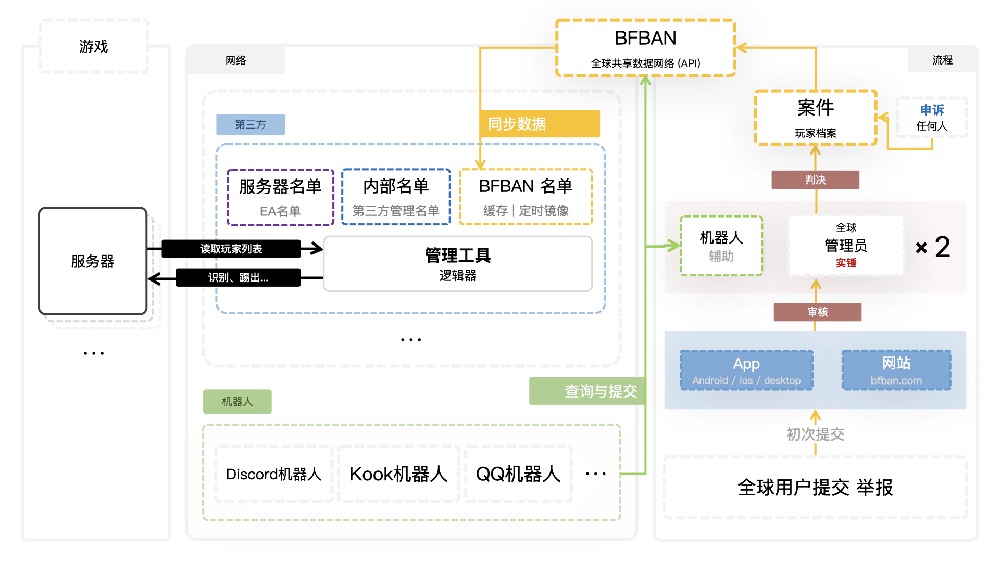

## 什么是BFBAN

这里有一张图，大概讲述BFBAN工作流程

> - 无论从BF1到BF2042都支持问题档案玩家查询，使得来自全球不同Battlefield服务器得以监控
> - 一切由社区掌控，公开透明，免费为所有接入BFBAN提供服务
> - 提供☁️数据库，使得来自全球不同Battlefield服务器，得以监控移除存在问题档案玩家

成为我们一员 - 维护社区环境

## 它的意义

* 建立起全球作弊玩家档案库

## 是谁在使用BFBAN

BFBAN 社区是一个多元化的群体，由以下几类成员组成：

1. **开发者**
    - **工具开发者**: 负责开发各种辅助工具，如举报机器人、战绩机器人等，用于辅助社区管理和玩家体验。
    - **应用开发者**: 开发移动端应用，如 BFBAN 助手，为玩家提供更便捷的服务。
    - **网站开发者**: BFVROBOT、战绩查询网站等。
2. **管理者**
   - **社区管理者**:
       - 判决者: 负责审核和处理玩家举报，做出公正的裁决。
       - 超级管理者: 负责管理特定地区或板块，协调社区事务。
       - 志愿者: 协助社区管理者，引导玩家，解答问题。
   - **服务器管理者**: 负责维护游戏服务器的运行，保障游戏环境的稳定。
3. **玩家**
    - **游戏玩家**: BFBAN 社区的核心用户，参与游戏，并通过社区平台进行交流、互动。

### BFBAN能提供什么？

BFBAN核心仅为服务器持有者、管理者提供作弊清单，隔离不受欢迎作弊玩家
